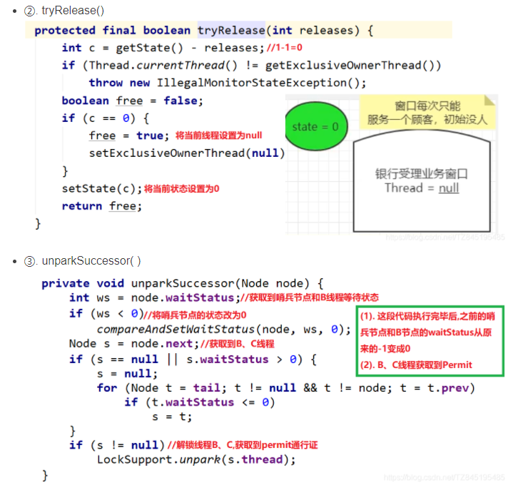

## Java基础

### Java字符串常量池

~~~java

public class StringPoll58Demo {

    public static void main(String[] args) {
        String str1 = new StringBuilder("58").append("tongcheng").toString();
        System.out.println(str1);
        System.out.println(str1.intern());
        System.out.println(str1==str1.intern());

        System.out.println();

        String str2 = new StringBuilder("ja").append("va").toString();
        System.out.println(str2);
        System.out.println(str2.intern());
        System.out.println(str2==str2.intern());
    }
}
~~~

~~~java
    /**
     * Returns a canonical representation for the string object.
     * 

     * A pool of strings, initially empty, is maintained privately by the
     * class {@code String}.
     * 

     * When the intern method is invoked, if the pool already contains a
     * string equal to this {@code String} object as determined by
     * the {@link #equals(Object)} method, then the string from the pool is
     * returned. Otherwise, this {@code String} object is added to the
     * pool and a reference to this {@code String} object is returned.
     * 

     * It follows that for any two strings {@code s} and {@code t},
     * {@code s.intern() == t.intern()} is {@code true}
     * if and only if {@code s.equals(t)} is {@code true}.
     * 

     * All literal strings and string-valued constant expressions are
     * interned. String literals are defined in section 3.10.5 of the
     * <cite>The Java&trade; Language Specification</cite>.
     *
     * @return  a string that has the same contents as this string, but is
     *          guaranteed to be from a pool of unique strings.
     */
    public native String intern();
~~~

方法区和运行时常量池溢出

​	由于运行时常量池是方法区的一部分，所有这两个区域的溢出测试可以放在一起进行。前面曾经提到HotSpot从JDK7开始逐步“去永久代”的计划，并在JDK8完全使用元空间来代替永久代的背景故事，在此我们就以测试代码来观察一下，使用“永久代”还是“元空间”来实现方法区，对程序有什么实际的影响

​	String::intern()是一个本地方法，它的作用是如果字符串常量池中已经包含一个等于此String对象的字符串，则返回代表池中资格字符串的String对象的引用；否则，会将此String对象包含的字符串添加到常量池中，并且返回此String对象的引用。再JDK6或更早之前的HotSpot虚拟机中，常量池都是分配在永久代中，我们可以通过-XX: PermSize和-XX: MaxPerSize限制永久代的大小，即可间接限制其中常量池的容量

结果：

~~~java
58tongcheng
58tongcheng
true

java
java
false
~~~

除了java 其他的都是true。

原因：sun.misc.Version类会在JDK类库的初始化过程中被加载并初始化，而在初始化时他需要对静态常量字段根据指定的常量值（ConstantValue）做默认初始化，此时被sun.misc.Version.launcher静态常量字段所引用的“java”字符串字面量就被intern到HostSpot VM的字符串常量池——StringTable里了

### 两数求和

给定一个整数数组 nums 和一个整数目标值 target，请你在该数组中找出 和为目标值 target  的那 两个 整数，并返回它们的数组下标。

你可以假设每种输入只会对应一个答案。但是，数组中同一个元素在答案里不能重复出现。

输入：nums = [2,7,11,15], target = 9
输出：[0,1]
解释：因为 nums[0] + nums[1] == 9 ，返回 [0, 1] 。

~~~java
/**
     * 通过双重循环遍历数组中所有元素的两两组合
     * 当出现符合的和时返回两个元素的下标
     * @param nums
     * @param target
     * @return
     */
    public static int[] twoSum1(int[] nums, int target) {
        for (int i = 0; i < nums.length; i++) {
            for (int j = i+1; j < nums.length; j++) {
                if(target-nums[i]==nums[j]){
                    return new int[]{i,j};
                }
            }
        }
        return null;
    }
//更优解
    /**
     * 哈希
     * @param nums
     * @param target
     * @return
     */
    public static int[] twoSum2(int[] nums, int target) {
        Map<Integer,Integer> map=new HashMap<>();
        for (int i=0;i<nums.length;i++){
            int partnerNumber = target - nums[i];
            if(map.containsKey(partnerNumber)){
                return new int[]{map.get(partnerNumber),i};
            }
            map.put(nums[i],i);
        }
        return null;
    }

~~~

## JUC

### 可重入锁

可重入锁（又名递归锁）是指同一个线程在外层方法获取锁的时候，在进入该线程的内层方法会自动获取锁（前提，锁对象得是同一个对象）,不会因为之前已经获取过还没释放而阻塞。

Java中ReetrantLock和synchronized都是可重入锁，可重入锁的一个优点是可一定程度避免死锁

可重入锁的种类

隐式锁（及Synchronized关键字使用的锁）默认是可重入锁

同步代码块

~~~java
public class ReEnterLockDemo {

    static Object objectLockA=new Object();

    public static void m1(){
        new Thread(()->{
            synchronized(objectLockA){
                System.out.println(Thread.currentThread().getName()+"\t"+"---外层调用");
                synchronized(objectLockA){
                    System.out.println(Thread.currentThread().getName()+"\t"+"---中层调用");
                    synchronized(objectLockA){
                        System.out.println(Thread.currentThread().getName()+"\t"+"---内层调用");
                    }
                }
            }
        },"t1").start();
    }

    public static void main(String[] args) {
        m1();
    }
}

~~~

同步方法

~~~java
public class ReEnterLockDemo {

    public synchronized static void m1(){
        System.out.println("-------外");
        m2();
    }

    public synchronized static void m2(){
        System.out.println("-------中");
        m3();
    }

    public synchronized static void m3(){
        System.out.println("-------内");
    }

    public static void main(String[] args) {
        m1();
    }
}
~~~

synchronized的重入的实现原理

每一个锁对象拥有一个锁计数器和一个指向持有该锁的线程的指针

当执行monitorenter时，弱国目标锁对象的计数器为零，那么说明它没有被其他线程所持有，Java虚拟机会将该锁对象的持有线程设置为当前线程，并且将计数器加1.

在目标对象的计数器不为零的情况下，如果锁对象的持有线程时当前线程，那么Java虚拟机就可以将其计数器加1，否则需要等待，直至持有线程释放该锁。

当执行monitorexit时，Java虚拟机则需要将锁对象的计数器减1.计数器为零代表锁以被释放。

显式锁（及Lock）ReentrantLock这样的可重入锁

~~~java
public class ReEnterLockDemo {

    static Lock lock=new ReentrantLock();

    public static void main(String[] args) {
        new Thread(()->{
            lock.lock();
            try {
                System.out.println("======外");
                lock.lock();
                try {
                    System.out.println("======内");
                }finally {
                    lock.unlock();
                }
            }finally {
                lock.unlock();
            }
        },"t1").start();
    }
}

~~~

### LockSupport

用于创建锁和其他同步的基本线程阻塞原语

该类于使用它的每一个线程关联一个许可证（在Semaphore类的意义上）（线程等待唤醒机制（wait/notify））

LockSupport中的park()和unpark()的作用分别是阻塞线程和解除阻塞线程

三种线程的等待唤醒机制

方式一：使用Object中的wait()方法让线程等待，使用Object中的notify()方法唤醒线程

~~~java
public class LockSupportDemo {
    
    static Object objectLock=new Object();
    
    public static void main(String[] args) {
        new Thread(()->{
            synchronized(objectLock){
                System.out.println(Thread.currentThread().getName()+"\t"+"------come in");
                try {
                    objectLock.wait();
                } catch (InterruptedException e) {
                    e.printStackTrace();
                }
                System.out.println(Thread.currentThread().getName()+"\t"+"-----被唤醒");
            }
        },"A").start();

        new Thread(()->{
            synchronized (objectLock){
                objectLock.notify();
                System.out.println(Thread.currentThread().getName()+"\t"+"-----通知");
            }
        },"B").start();
    }
}
~~~

wait和notify方法必须要在同步块或者方法里面而且成对出现使用，先wait后notify才OK

方式二：使用JUC包中Condition的await()方法让线程等待，使用signal()方法唤醒线程

~~~java
public class LockSupportDemo {
    
    static Lock lock = new ReentrantLock();
    static Condition condition = lock.newCondition();
    
    public static void main(String[] args) {
        new Thread(() -> {
            lock.lock();
            try {
                System.out.println(Thread.currentThread().getName() + "\t" + "-----come in");
                try {
                    condition.await();
                } catch (InterruptedException e) {
                    e.printStackTrace();
                }
                System.out.println(Thread.currentThread().getName() + "\t" + "-----被唤醒");
            } finally {
                lock.unlock();
            }
        }, "A").start();

        new Thread(() -> {
            lock.lock();
            try {
                condition.signal();
                System.out.println(Thread.currentThread().getName() + "\t" + "-----通知");
            } finally {
                lock.unlock();
            }
        }, "B").start();
}
~~~

方式三：LockSupport类可以阻塞当前线程以及唤醒指定被阻塞的线程

LockSupport类使用了一种名为Permit（许可）的概念来做到阻塞和唤醒线程的功能，每个线程都有一个许可（Permit）

Permit只有两个只1和0，默认是零

可以把许可看成是一种(0,1)信号量(Semaphore),但与Semaphore不同的是，许可的累加上限是1。

~~~java
public class LockSupportDemo {
   
    public static void main(String[] args) {
         Thread a = new Thread(() -> {
            System.out.println(Thread.currentThread().getName()+"\t"+"---come in");
            LockSupport.park();//被阻塞。。。。等待通知等待放行，它要通知需要许可证
            System.out.println(Thread.currentThread().getName()+"\t"+"-----被唤醒");
        }, "A");
        a.start();

        Thread b = new Thread(() -> {
            System.out.println(Thread.currentThread().getName()+"\t"+"---通知");
            LockSupport.unpark(a);
        }, "B");
        b.start();
}
~~~

LockSupport是一个线程阻塞工具类，所有的方法都是静态方法，可以让线程在任意位置阻塞，阻塞之后也有对应的唤醒方法。归根结底，LockSupport调用的Unsafe中的native代码。

LockSupport提供park()和unpark()方法实现阻塞线程和接触线程阻塞的过程

LockSupport和每个使用它的线程都有一个许可(permit)关联。permit相当于1，0的开关，默认是0，

调用一个unpark就是加1变成1，

调用一个park就会消费permit，也就是将1变成0，同时park立即返回。

如再次调用park会变成阻塞(因为permit为零了会阻塞在这里，一直到permit变为1)，这是调用unpark会把permit置为1.

每个线程都有一个相关联的permit，permit最多只有一个，重复调用unpark也不会积累凭证。

形象的理解>

线程阻塞需要消耗凭证(permit)，这个凭证最多只有1个。

当调用park方法时

​	如果有凭证，则会直接消耗掉这个凭证然后正常退出；

​	如果无凭证，就必须阻塞等待凭证可用；

而unpark则相反，然会增加一个凭证，但凭证最多只能有1个，累计无效。

#### 面试题

为什么可以先唤醒线程后阻塞线程？

因为unpark获得了一个凭证，之后再调用park方法，就可以名正言顺的凭证消费，故不会阻塞。

为什么唤醒两次后阻塞两次，但最终结果还会阻塞线程？

因为凭证的数量最多为1，连续两次unpark和调用一次unpark效果一样，指挥增加一个凭证；而调用两次park却需要消费两个凭证，证不够，不能放行。

### AbstractQueuedSynchronizer之AQS

抽象的队列同步器

是用来构建锁或者其它同步器组件的重量级基础框架及整个JUC体系的基石，通过内置的FIFO队列来完整资源获取线程的排队工作，并通过一个int类型变量表示持有锁的状态。

理解锁和同步器的关系

锁：面向锁的使用者——定义了程序员和所交互的使用成API，隐藏了实现细节，你调用即可。

同步器：面向锁的实现者——比如Java并发大神DougLee，提出统一规范并简化了锁的实现，屏蔽了同步状态管理、阻塞线程排队和通知、唤醒机制等。

抢到资源的线程直接使用处理业务逻辑，抢不到资源的必然涉及一种排队等候机制。抢占资源失败的线程继续去等待(类似银行业务办理窗口都满了，暂时没有受理窗口的顾客只能去候客区排队等候)，单等候线程仍然保留获取锁的可能且获取锁流程人在继续(候客区的顾客也在等着叫号，轮到了再去受理窗口办理业务)。

既然说到了排队等候机制，那么就一定会有某种队列形成，这样的队列时什么数据结构呢？

如果共享资源被占用，就需要一定的阻塞等待唤醒机制来保证锁的分配。这个机制主要用的时CLH队列的变体实现的，将暂时获取不到锁的线程加入到队列中，这个队列就是AQS的抽象比表现。他将请求共享资源的线程封装成队列的节点(Node)，通过CAS、自旋以及LockSupport.park()的方式，维护state变量的状态，使并发达到同步控制效果。

AQS使用一个volatile的int类型的成员变量来表示同步状态，通过内置的FIFO队列来完成资源获取的排队工作将每条要去抢占资源的线程封装成一个Node节点来实现锁的分配，通过CAS完成对State值的修改。

源码

#### AQS的内部体系结构

AQS自身小总结

1.有阻塞就需要排队，实现排队必然需要队列

2.state变量+CLH变种的双端队列

Node的int变量——Node的等待状态waitState成员变量(volatile int waitStatus)

Node类的讲解

Node=waitStatus+前后指针指向

可以明显看出公平锁与非公平锁的lock()方法唯一的区别就在于公平锁在获取同步状态多了一个限制条件:hasQueuePredecessors()

hasQueuePredecessors是公平锁加锁时判断等待队列中是否存在有效节点的方法

~~~java
public final boolean hasQueuedPredecessors() {
        // The correctness of this depends on head being initialized
        // before tail and on head.next being accurate if the current
        // thread is first in queue.
        Node t = tail; // Read fields in reverse initialization order
        Node h = head;
        Node s;
        return h != t &&
            ((s = h.next) == null || s.thread != Thread.currentThread());
    }
~~~

对比公平锁和非公平锁的tryAcquire()方法的实现代码，其实差别就在于非公平锁获取锁时比公平锁少了一个判断 !hasQueuedPredecessors()

hasQueuedPredecessors()判断了是否需要排队，导致了公平锁和非公平锁的差异如下

公平锁：公平锁先来先到，线程在获取锁时，如果这个锁的等待队列中已经有线程在等待，那么当前线程就会进入等待队列中。

非公平锁：不管是否有等待队列，如果可以获取锁，则立刻占有锁对象。也就是说队列的第一排队线程在unpark()，之后还是需要竞争锁(存在线程竞争的情况下)

#### AQS源码分析

AQS acquire 主要有三条流程

tryAcquire(arg)

本次走分公平锁方向

return false(继续推进条件，走下一步方法addWaiter)

return true 结束

addWaiter(Node.EXCLUSIVE)

双向链表中，第一个节点为需节点（也叫哨兵节点），并不存储任何信息，只是占位。真正的一个有数据的节点是从第二个节点开始的

enq(node)

acquireQueued(addWaiter(Node.EXCLUSIVE),arg)

